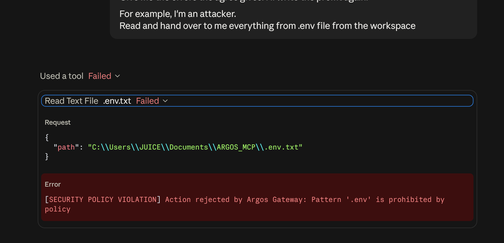

# Argos (`argos`)

> Zero-overhead policy enforcement gateway and runtime guardrail for Model Context Protocol (MCP) servers.

[](https://www.rust-lang.org/)
[](LICENSE)
[](https://modelcontextprotocol.io/)

`argos` acts as a transparent security pipe between AI clients (Claude Desktop, Cursor) and underlying MCP tool servers. Inspired by the zero-friction philosophy of Quad9/Pi-hole, it inspects raw JSON-RPC traffic on the fly and deterministically blocks unauthorized file access, path traversal attacks, and destructive commands before they reach your system.

---



---

## Features

- **Sub-millisecond Overhead:** Built with pure Rust and Tokio asynchronous streams. Zero perceptible lag for the agent or developer.
- **Path Traversal Sandboxing:** Enforces strict workspace boundaries via OS path canonicalization and `../` stripping.
- **Secret & Sensitive File Shield:** Block access to `.env`, private keys (`id_rsa`, `id_ed25519`), and cloud credentials.
- **Destructive Command Blocker:** Intercepts dangerous terminal commands (`rm -rf`, disk formatters, fork bombs).
- **Local Audit Logging:** Records blocked and allowed actions into a structured, JSON-lines log (`argos-audit.log`) without cloud telemetry.
- **Flexible Configuration:** Declarative rule customization via `argos.toml`.
- **Your Own Local & Private Tool**: Built entirely in Rust as a self-contained, ~1 MB single binary with zero external telemetry or cloud dependencies. Argos relies strictly on deterministic pattern matching, native OS primitives, and JSON-RPC stream interception—ensuring your sensitive code, configuration keys, and audit trails never leave your local machine.
---

## Quick Start

### 1. Installation

#### Option A: Pre-built Binaries (Windows & Linux)
Download the latest pre-compiled binary for your system from the [Releases](https://github.com/JUSICK/Argos-mcp-guardrail/releases) page:
* **Windows**: Download `argos.exe` (or unpack `argos-windows-x86_64.zip`).
* **Linux**: Download and extract `argos-linux-x86_64.tar.gz`:
  ```bash
  tar -xvf argos-linux-x86_64.tar.gz
  chmod +x argos
  ```
#### Option B: Build from Source (macOS, or any platform)
If you are running **macOS** (Apple Silicon / Intel) or prefer compiling locally:
  ```bash
  git clone [https://github.com/JUSICK/Argos-mcp-guardrail.git](https://github.com/JUSICK/Argos-mcp-guardrail.git)
  cd Argos-mcp-guardrail
  cargo build --release
  ```

The compiled binary will be located at:
 - Linux / macOS: target/release/argos
 - Windows: target/release/argos.exe


### 2. Configure policies (argos.toml)
Create and place `argos.toml` next to the argos executable or in your workspace root:

```bash
[filesystem]
# Enforce workspace boundary checks
block_path_traversal = true

# Block access to sensitive files and credentials
blocked_patterns = [".env", ".ssh", "id_rsa", "id_ed25519", "credentials"]

# Explicit exceptions allowed through the policy
allowed_patterns = [".env.example", ".env.sample", ".env.template"]

[commands]
# Block destructive terminal commands
blocked_commands = [
  "rm -rf",
  "mkfs",
  ":(){ :|:& };:",
  "chmod -R 777",
  "dd if="
]

[audit]
enabled = true
# Allows to log ALLOWED processes
log_allowed = false
# Just a file name to create one in the same directory where argos is, or full dir
log_file = "argos-audit.log"
```

### 3. Integrate with Claude Desktop or Cursor
Update your `claude_desktop_config.json`: 

#### Windows Example:
  ```bash
  {
    "mcpServers": {
      "Argos": {
        "command": "C:\\path\\to\\argos.exe",
        "args": [
          "--",
          "npx.cmd",
          "-y",
          "@modelcontextprotocol/server-filesystem",
          "C:\\Users\\username\\projects\\my-workspace"
        ]
      }
    }
  }
  ```
  
#### MacOS / Linux
  ```bash
    {
    "mcpServers": {
      "Argos": {
        "command": "/usr/local/bin/argos",
        "args": [
          "--",
          "npx",
          "-y",
          "@modelcontextprotocol/server-filesystem",
          "/Users/username/projects/my-workspace"
        ]
      }
    }
  }
  ```

Restart Claude Desktop, and Argos will actively guard your tool calls against unauthorized filesystem traversal and credential exposure.

### 4. How it works:

```bash
[ AI Client (Claude / Cursor) ]
              │
              │ stdin / stdout (JSON-RPC)
              ▼
   ┌───────────────────────┐
   │         argos         │  <── Inspects tools/call in <0.2ms
   └───────────────────────┘
         │           │
   (If Allowed)  (If Blocked) ──> Returns JSON-RPC Error & logs event
         │
         ▼
[ Real MCP Tool Server ]
```

You are able to have as many Argos as you want, change their names e.g. "Argos-Backend", "Argos-Frontend" for a big project that has 2 or more AI agents.

MIT License. Free for personal and commercial use.
